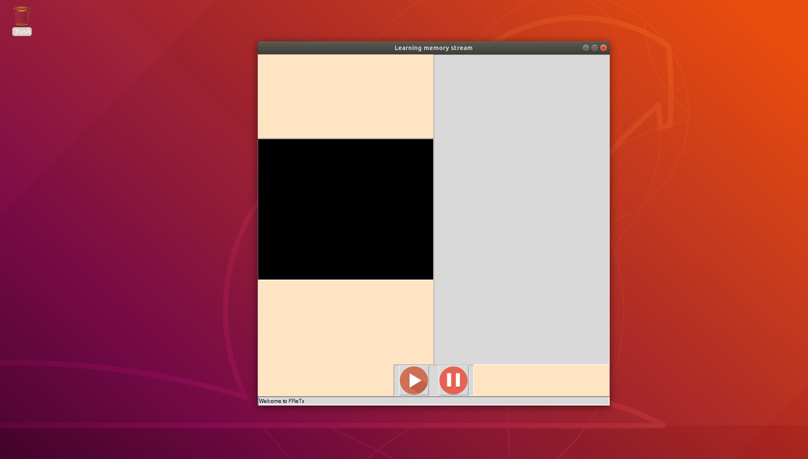

# LMDT
Learning Memory Device and Tracking

 * [Introduction](#introduction)
 * [Documentation](#documentation)
    * [Download](#download)
    * [Open the program](#open-the-program)
    * [Start the experiment](#start-the-experiment)
    * [Analysis](#analysis)
    
    
 
## Introduction
**LMDT** (**L**earning **M**emory **D**evice and **T**racking)

A Python interface to monitor and interact with flies in an olfactory memory setup, together with an R package for analysis of the resulting data.


## Documentation

#### 1 Login 

Username: **FSL**
Password: **flysleep1**

#### 2 Open program

* **Open a terminal**
You can do it thre ways
a) Press on the terminal icon on the launcher to the left
 

b) Press **windows key** and type **terminal**. Then press **enter**
c) Press Control+Alt+T


#### Open the program
Type this after entering the folder you have downloaded (with `cd`)

```
/home/luna.kuleuven.be/u0127714/anaconda3/envs/CV/bin/python -m LMDT --track --camera pylon --arduino --mapping mappings/main.csv --program programs/test_28_march.csv --duration 120
```
This will trigger the opening of the following window

 

loaded with the following settings:

* Use the pylon camera to track flies
* Run the program contained in test_28_march.csv
* Close in 2 hours (120 minutes)

#### Start the experiment

Pressing the play button will start the tracking and the arduino events for your experiment.
You can pause and play it again for whatever reason.
The program can be closed by clicking on the top right x or pressing Control C on the terminal window that was used to launch the program 

#### Analysis

By default tracking and arduino events data are recorded to .csv files `data/` and `metadata/` respectively. The filenames are the same and follow the pattern:

*prefix* _ *date* _ *time*

* prefix is set in the config.yaml file (look at the **store** subentry in the arduino and tracker entries. Default is **store** for both. It can be changed at will!
* date follows the format year-month-day.
* time follows the format hour-minute-second.


## Enhancements


You are very welcome to push your ideas for improvements to the repo's issue page in https://gitlab.com/flysleeplab/learning-memory-feedback-and-tracking/issues . Open a new issue and describe it with your best words.
 

