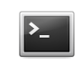
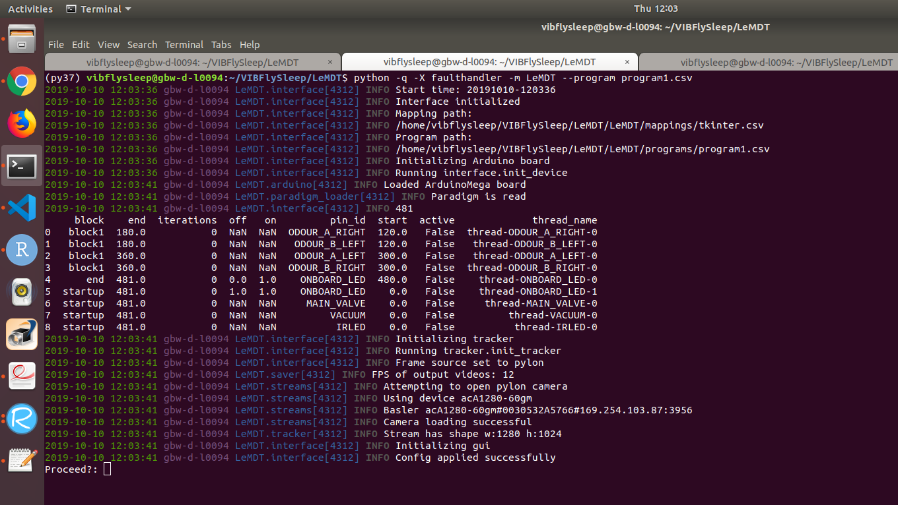
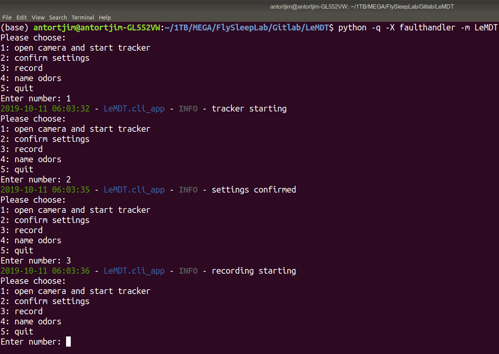
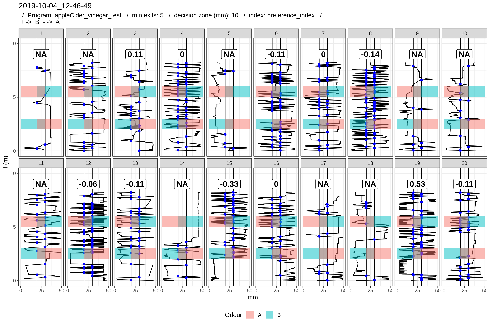
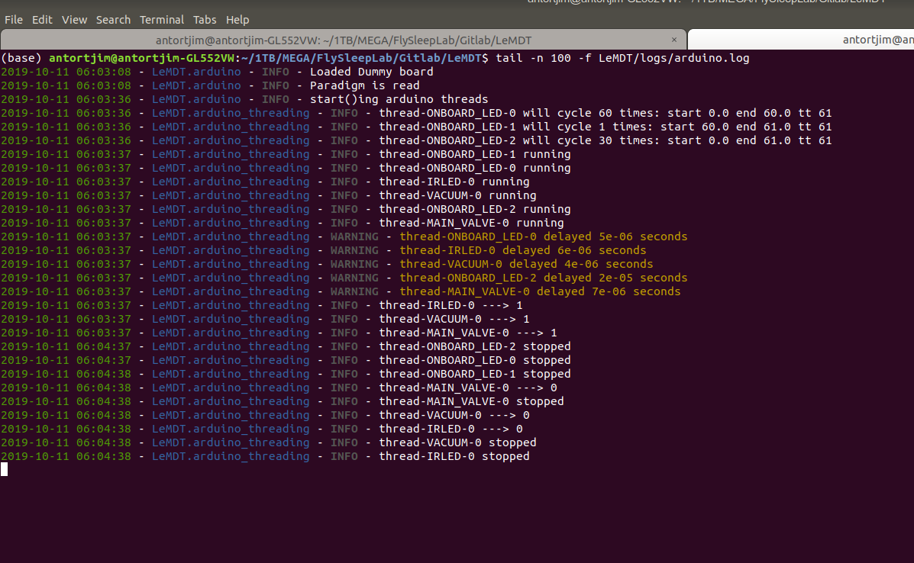

# LeMDT
Learning Memory Device and Tracking

 * [Introduction](#introduction)
 * [How to do an experiment](#how-to-do-an-experiment)
    * [Open software](#open-software) 
    * [Run software](#run-software) 
    * [Start the experiment](#start-the-experiment)
    * [Browse and understand your results](Browse-and-understand-your-results)
    * [Analyze traces](#analyze-traces)
 * [Make a paradigm](#make-a-paradigm)
 * [Indices](#indices)
  * [Read the logs](#read-the-logs)
 * [Enhancements](#enhancements)
    
 
## Introduction
**LeMDT** (**Le**arning **M**emory **D**evice and **T**racking).*

_AN IDEA FOR A BETTER NAME IS VERY WELCOME!_ (_see_ https://martinfowler.com/bliki/TwoHardThings.html)

A Python interface to monitor and interact with flies in an olfactory memory setup, together with an R package for analysis of the resulting data.


## How to do an experiment

### Open software

Login to the computer with the following credentials

Username: **FSL**
Password: **flysleep1**


* **Open a terminal**
You can do it thre ways
a) Press on the terminal icon on the launcher to the left
 

b) Press **windows key** and type **terminal**. Then press **enter**
c) Press Control+Alt+T

* **Call the software from the terminal**

* Go to the folder containing the code and execute the software

```
# Change Directory (cd) to the following folder:
cd /home/vibflysleep/VIBFlySleep/LeMDT

# Launch the software with a default program
python -q -X faulthandler -m LeMDT
# OR
python -q -X faulthandler -m LeMDT --program program1.csv
```

As of 11/10/2019, the program (paradigm) can only be specified via this the launching command, and not once the software has started. A list of programs is available in:

```
/home/vibflysleep/VIBFlySleep/LeMDT/LeMDT/programs
```
you can refer to them by typing the filename after `--program`.
Learn more about programs and blocks in the reference.md

After running that command, you will get something that looks like

<!-- -->

### Run software

The software is powered with a Command Line Interface (CLI). The software gives a list of numbered options to the user, who must select one of them to continue. An option is selected by typing one number (1-5) and pressing Enter. The menu comes back to the console immediately after selecting any option. 

```
Please choose:
1: open camera and start tracker
2: confirm settings
3: record
4: name odors
5: quit
Enter number: 

```

`1: open camera and start tracker`: launch the tracker module and visualize a live feed to check the settings are correct, prior to doing the actual experiment. The live feed will be available under [file:///tmp/last_img.jpg](file:///tmp/last_img.jpg)

`2: confirm settings`: confirm settings and chamber detection are correct, locking further setting refinement.

`3: record`: start the experiment! This will start the paradigm and record the position of the flies in the arenas

`4: name odors`: prompt the user to give a name to odors A and B for the sake of documenting the experiment. The information is stored in a file called `odors.csv`under the folder resulting from the experiment

`5: quit`: close the program. Upon this action, the user will be prompted to save or discard the data created in the current experiment. Everything will be saved unless `N`is replied



A minimal log of the user actions will be displayed in the console. Full logs can be found in the `LeMDT/logs/` folder when the experiment is going on, and in the resulting folder once it is finished (if the user confirms that results shall be stored). Please read this in order to understand how to read logs.

### Browse and understand your results

All results are saved by default to `lemdt_results/DATETIME/` where datetime is the date and time at which option 3 was selected in format `YYYY-MM-DD_HH-MM-SS`. In that folder you will find:

* `1: PREFIX_annotated.avi`: a video containing all frames analyzed after selecting option. Frames are annotated, i.e. the arenas and flies are displayed in boxes and frame number and time information is shown on the corners.

* `2: PREFIX_original.avi`: same as 1) without any annotation. These are the frames as the camera first produced them.

* `3: PREFIX.csv`: the main results file, it is a plain text file in comma separated value (csv) format with columns:

`frame,arena,cx,cy,datetime,t,ODOUR_A_LEFT,ODOUR_A_RIGHT,ODOUR_B_LEFT,ODOUR_B_RIGHT,eshock_left,eshock_right`

it reports for each row of data:

* the frame number
* the arena (fly) number (1-20)
* the coordinates of the fly on the x and y dimension with respect to the top left corner of the arena
* datetime
* t (number of seconds since option 3 was selected)
* the remanining columns capture the state of the setup at that precise instant

All this information is key to capture the olfactory memory and is analyzed with the help of R (see next section)


* `4: paradigm.csv`: another plain text file in csv format with columns 

`,pin_id,start,end,iterations,on,off`

it reports for ech row data

* an Arduino pin name, i.e. an electromechanical component of the setup
* start and end i.e. time with respect to the start of the experiment, when the pin is enabled and disabled
* iterations a field stating which repetition of the block this row corresponds to (not important)
* on and off specify the duty cycle (if any). This is mainly relevant for electro shock pins, as most paradigms use a cycle of 0.2 Hz (1" on, 4" off)

* `5: .logs`: log files thata can be read as explained in the section.

* `6: odors.csv`: (OPTIONAL) a file naming odor A and B so as to improve the experiment's documentation.


A mirror of `lemd_results`is maintained on the L drive under `Common_Lab_Data/lemdt_results/`

### Analyze traces

Together with the Python software, LeMDT comes with an R package (LeMDTr) that makes it easy to analyze your traces.csv file.

Launch Rstudio and enter

```
preprocess_and_plot(experiment_folder = PATH_TO_EXPERIMENT_RESULTS_FOLDER)
```
where `PATH_TO_EXPERIMENT_RESULTS_FOLDER` is a `character` containing the path to your results folder.
You can get it by doing the following:

1. Enter the folder with the file browser (Nautilus in Ubuntu)
2. Press Control+L (selects the path)
3. Press Control+C (copies the path)
4. Go to Rstudio and type two double quotes ("")
5. Put the cursor in between them and press Control+V (paste the path)

You now have a character with the path! ;)

If you run the R command above, you will get both on Rstudio and on the results folder a new plot




The plot shows the position of the flies over time (time is on Y and position on X). Time moves forward as you move to the top of the plot i.e. time 0 is on the bottom.

* Rectangles annotate when a valve releasing a specific odor to the chambers was active (given by your paradigm). The odor id is annotated  automatically if you provided the names via option 4 of the Python CLI. Alternatively, you can pass their names with the `A` and `B` arguments to `preprocess_and_plot`. If neither an odors.csv file nor these arguments are supplied, a default name of 'A' and 'B' is given to them.

* Annotation for the electro shocks is not yet supported.

* The value of the index overall during all the testing periods is displayed on the top (see section).

* The decision zone is a central region in the chamber where both odors mix and the drive any of them could exert on the fly is assumed to be canceled. Exits from this zone represent the "decision" of the fly to move toward one of the odors. The default width of this region is 10mm, and it can be changed via the `decision_zone_mm` argument.

* An index is computed as long as `min_exits_required` or more happen during the test (while the odours are active). The default is 5, but you should change to keep it proportional to the amount of time the flies had to take decisions i.e the amount of time the odors were active. If less than this amount occurs or any other issue arises, the value displayed is NA (not assigned).

* If you want to discard any data after n minutes, you can supply n in the `max_time_minutes` argument.
 
* Blue dots represent exits (crosses) of the fly from the decision zone to either side.

* The default index function is the preference_index, but other may be available. You can change the index function with the `index_function`.

* If you wish to display a subset of flies, provide a numeric vector to the `selected_flies` argument i.e. `selected_flies = c(2,5,8)` will show the flies in arenas 2,5 and 8.
If you want everything between 1 and 10, you can type 1:10. So this is also possible -> c(1:10, 15) will show 1 to 10 and 15 too.

* The plot comes with comprehensive annotation by default, so it is easy to share with your peers. This includes the date and time of the experiment (which serves as identifier of the folder name in lemdt_results), the name of the program that was used to create the paradigm, as well as the value of `min_exits_required`, `decision_zone_mm` and `index_function`. The user can add custom annotation via the `annotation`argument.

### Make a paradigm

This section is under development and is not stable. However, the following procedure is stable:

create a csv file under `LeMDT/blocks` and give it a meaningful name
Write your paradigm there. This is the content of `block1.csv`

```
pin_id,start,end,on,off,block
ODOUR_A_RIGHT, 02,03,NaN,NaN,
ODOUR_B_LEFT,  02,03,NaN,NaN,

ODOUR_A_LEFT,  05,06,NaN,NaN,
ODOUR_B_RIGHT, 05,06,NaN,NaN,
```
 
 
this file states that odorA and odorB will be present on the right and left sides of the chamber respectively, 2 minutes after the start of the block
they will appear again, but swapping their position, at minute 5. Both times they stay for 1 minute.
The name of the pins can be found here: 
https://gitlab.com/flysleeplab/learning-memory-feedback-and-tracking/blob/dev/LeMDT/mappings/tkinter.csv

**Don't remove the comma after the second NaN**.


Then create a csv file in the `LeMDT/programs` folder and give it a meaningful name. Follow the template given by `program1.csv`

```
block,start,times
block1,                    00,01
end,                       08,01
startup,                   00,01
```

1. change block1 by the name of the block file you created (without the .csv extension).
2. state when do you want that block to start i.e. how much time after pressing record (option 3) in the start column.
3. state when do you want the paradigm to stop by changing the start of the "end" block.
4. don't change the startup row.
5. if you want to repeat your block, change the 01 for whatever amount of times you want to repeat. This is not fully tested yet and thus not recommended.

If you need to provide a time measure that needs resolution beyond minutes i.e. 1.5 minutes, you can do so by typing a fraction so the resulting number is stil in minutes. For instance, if you want to start your block after 1.5 minutes, you can type 90/60 or 1.5. This is also available for specifyng the on and off cycles of the electro shocks i.e.

```
EL_SHOCK_LEFT,  05,06,1/60,4/60,
EL_SHOCK_RIGHT, 05,06,1/60,4/60,
```

would be correct syntax. This will enable the electro shock modules from minute 5 to 6 and they will cycle 12 times, 1 second on ann 4 off ((4+1)*12=60)


### Indices
 
 Preference index
 
 $$
 PI = (\text{exit_right} - \text{exit_left}) / \text{total_exits}
 $$

Takes values from 1 to -1.

* Value of 1 represents total preference for the odor on the right (odor B)
* Value of -1 represents total preference for the odor on the right (odor A)
* Value of 0 represents no preference for any odor

The power and resolution of the index is bigger the more exits the fly takes i.e. a slightly lower index that results from many exits is more significant than an index computed from 3 exits.

Please mind that even though you may place both odours on either sides of the chambers during the experiment (like in the plot above), the algorithm treats internally odor B as being "the right odor", and odor A "the left odor". This confusing detail is taken care of internallt. The user only needs to remember the meaning of the sign of the number. + means preference index for B and viceversa.


### Read the logs


All logs have the same structure. Each part is separated by `- `

```
1) Date and time
2) Name of module producing the log
3) Severity level from less to more critical (debug, info, warning, error, exception)
4) Actual log message. The color of this line depends on the severity level
```

The logs can be opened with any text editor, like Gedit, Vim or Nano in Ubuntu, or Notepad++ on Windows. However, it is recommended to open them with `tail -f` or `cat` to enjoy color rendering.

In order to be able to read the live logs from the arduino modules, execute

`tail -n 100 -f LeMDT/logs/arduino.log`

The log tells us for instance, that the main valve was turned on at 06:03:37, and turned off 1 minute after, at 06:04:37.





## Enhancements


You are very welcome to push your ideas for improvements to the repo's issue page in https://gitlab.com/flysleeplab/learning-memory-feedback-and-tracking/issues . Open a new issue and describe it with your best words.


**TO DO**

* Write unit tests for everything specially the paradigm loader module
* Show a plot of the paradigm so it becomes easier to check
* Provide control of fps and acquistion time on the cli
* Save coordinates of the arenas so any tracker can repeat the analysis offline

 

