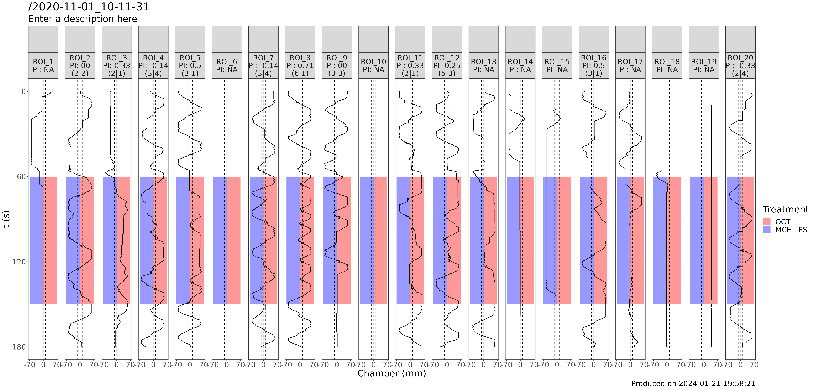

```{r, include = FALSE}
knitr::opts_chunk$set(
  collapse = TRUE,
  comment = "#>"
)
```

## Data description

The IDOC output dataset consists of a folder, named according to the date and time in which the experiment was ran (```YYYY-MM-DD_HH-MM-SS```). If you run multiple tests or conditioning sessions, **each session gets its own folder** by default in the root directory. It is however and encouraged to later create another folder which can host all folders of sessions connected in some meaningful way, for easy archiving and processing of data.

The data for each animal in the experiment is captured in separate .csv files with the naming convention ```YYYY-MM-DD_HH-MM-SS_machine-id_ROI_X.csv```. There are 20 files, one for each ROI.
```YYYY-MM-DD_HH-MM-SS_machine-id``` is a prefix which all output files produced by IDOC and idocr contain in their name, so it's easy to trace back which experiment they belong to

This is a comprehensive description of all the output files produced by IDOC. All of them are required for analysis

```
2020-11-01_10-11-31/
├── 2020-11-01_10-11-31_7eb8e224bdb944a68825986bc70de6b1_CONTROLLER_EVENTS.csv
├── 2020-11-01_10-11-31_7eb8e224bdb944a68825986bc70de6b1_METADATA.csv
├── 2020-11-01_10-11-31_7eb8e224bdb944a68825986bc70de6b1_ROI_10.csv
├── 2020-11-01_10-11-31_7eb8e224bdb944a68825986bc70de6b1_ROI_11.csv
├── 2020-11-01_10-11-31_7eb8e224bdb944a68825986bc70de6b1_ROI_12.csv
├── 2020-11-01_10-11-31_7eb8e224bdb944a68825986bc70de6b1_ROI_13.csv
├── 2020-11-01_10-11-31_7eb8e224bdb944a68825986bc70de6b1_ROI_14.csv
├── 2020-11-01_10-11-31_7eb8e224bdb944a68825986bc70de6b1_ROI_15.csv
├── 2020-11-01_10-11-31_7eb8e224bdb944a68825986bc70de6b1_ROI_16.csv
├── 2020-11-01_10-11-31_7eb8e224bdb944a68825986bc70de6b1_ROI_17.csv
├── 2020-11-01_10-11-31_7eb8e224bdb944a68825986bc70de6b1_ROI_18.csv
├── 2020-11-01_10-11-31_7eb8e224bdb944a68825986bc70de6b1_ROI_19.csv
├── 2020-11-01_10-11-31_7eb8e224bdb944a68825986bc70de6b1_ROI_1.csv
├── 2020-11-01_10-11-31_7eb8e224bdb944a68825986bc70de6b1_ROI_20.csv
├── 2020-11-01_10-11-31_7eb8e224bdb944a68825986bc70de6b1_ROI_2.csv
├── 2020-11-01_10-11-31_7eb8e224bdb944a68825986bc70de6b1_ROI_3.csv
├── 2020-11-01_10-11-31_7eb8e224bdb944a68825986bc70de6b1_ROI_4.csv
├── 2020-11-01_10-11-31_7eb8e224bdb944a68825986bc70de6b1_ROI_5.csv
├── 2020-11-01_10-11-31_7eb8e224bdb944a68825986bc70de6b1_ROI_6.csv
├── 2020-11-01_10-11-31_7eb8e224bdb944a68825986bc70de6b1_ROI_7.csv
├── 2020-11-01_10-11-31_7eb8e224bdb944a68825986bc70de6b1_ROI_8.csv
├── 2020-11-01_10-11-31_7eb8e224bdb944a68825986bc70de6b1_ROI_9.csv
├── 2020-11-01_10-11-31_7eb8e224bdb944a68825986bc70de6b1_ROI_CENTER.csv
├── 2020-11-01_10-11-31_7eb8e224bdb944a68825986bc70de6b1_ROI_MAP.csv
├── 2020-11-01_10-11-31_7eb8e224bdb944a68825986bc70de6b1_VAR_MAP.csv
└── PREFERENCE_TEST_ONCE_A_RIGHT.csv
```


* ```YYYY-MM-DD_HH-MM-SS_machine-id_ROI_X.csv```: Contains columns `id,x,y,w,h,phi,xy_dist_log10x1000,is_inferred,has_interacted,frame_count,t`

   * id: set always to 0 (can be ignored)
   * x: Number of pixels from the left (West) most end of the chamber until the estimated centroid of the fly in the IDOC chamber
   * y: Number of pixels from the top (North) most end of the chamber until the estimated centroid of the fly in the IDOC chamber
   * w: Width of the segmented fly (not used in analysis)
   * h: Height of the segmented fly (not used in analysis)
   * phi: Angle of the segmented fly (not used in analysis)
   * xy_dist_log10x1000: Distance traveled (in pixels) between the previous frame and the current frame, and then transformed using the formula $$log_{10}(d) * 1000$$
   * is_inferred: Whether the fly could not be found in that frame and it's position is inferred from the last observed position
   * has_interacted: Always set to 0 (can be ignored)
   * frame_count: It's not 0 or 1 indexed, but it contains an integer that increases by one with every new frame
   * t: Time in seconds since the beginning of the experiment until the corresponding observation

Our tracking system is heavily based on the ethoscope system, which offers a lightweight but accurate Python based system to track multiple isolated flies live.

* ```YYYY-MM-DD_HH-MM-SS_machine-id_VAR_MAP.csv```: Summarizes the `_ROI.csv` information listeed above in a computer friendly format

* ```YYYY-MM-DD_HH-MM-SS_machine-id_ROI_MAP.csv```: Contains the top left corner coordinate, as well as width and height of each of the 20 ROIs in the original raw frame, relative to the top left corner of the frame. For example:

```
,x,y,w,h,value,idx
0,332,87,181,39,1,1
```
indicates that ROI 1 has it's left corner 332 pixels from the left of the frame and 87 pixels from the top. it is 181 pixels wide and 39 high.

* ```YYYY-MM-DD_HH-MM-SS_machine-id_METADATA.csv```: Contains settings that were passed to IDOC to start the experiment, useful for documentation purposes.

* ```YYYY-MM-DD_HH-MM-SS_machine-id_CONTROLLER_EVENTS```: It contains one row every time the state of the IDOC peripherals changes. The row reports the state of each peripheral (either `1` on or `0` off), and the time at which this state was recorded. Useful to document the experiment, generate plots or debug issues.

* Moreover, a copy of the paradigm file you selected for the session is copied to the folder, for reproducibility purposes. This file does not necessarily follow the naming convention of the other files. In the example above, it would be `PREFERENCE_TEST_ONCE_A_RIGHT.csv`.


Once your experiment is finished, please generate the ```YYYY-MM-DD_HH-MM-SS_machine-id_ROI_CENTER.csv```:
TODO
It contains one row for every ROI 20, and two fields, `region_id` and `center`. `region_id` identifies one ROI, and `center` contains the x coordinate of the center of the chamber. It is required for analysis, because it is used to generate the treatment decision zone.


## Analysis

### Load the package
Start by loading the package
```{r setup}
library(idocr2)
```

### Establish analysis settings

Provide the path to the IDOC session you want to analyze. In this vignette, we will use an example dataset packaged together with the code.
```{r}
experiment_folder <- system.file("extdata/2020-11-01_10-11-31", package = "idocr2")
```

Give names to treatments A and B placeholders -> See paradigms section
```{r}
treatment_A <- "OCT"
treatment_B <- "MCH+ES"

```

Optionally provide a description that briefly documents or describes the session

```{r}
description <- "Enter a description here"
```


Minimal number of exits required to consider the data of one animal significant and so, compute a preference index based on the behavior
```{r}
min_exits_required <- 3
```


Optionally, apply a time offset to the treatment time series to account for the time it takes for odour to arrive to the chambers. In seconds
```{r}
delay <- 0
```

Carefully define a distance from the center of the chamber to the decision zone, in mm
```{r}
border_mm <- 5
```

**Caution** The choice of `border_mm` can have a big impact in the interpretation of the results. You should define it based on empirical evidence that within this distance from the center of the chambers, both treatments are mixed.
We found that to be 5 mm either side based on tests with smoke.


Ignore exits happening this amount of seconds after the previous exit to avoid counting the same exit as two exits happening within ridiculously little time  
```{r}
mask_duration <- 0.5
```

### Generate analysis_params.yaml by providing 3 numbers:

`pixel_to_mm_ratio`: Number of pixels that make up 1 mm in your setup. Simply place a ruler and count how many pixels cover 1 mm, or 1 cm and divide by 10.
`limits`: mm away from the center to the left (negative) or right (positive) to be included in the plot. For example:

**analysis_params.yaml**
```
pixel_to_mm_ratio: 2.3
limits:
- -70
- 70
```


### Run the analysis

```{r}
src_file <- rstudioapi::getActiveDocumentContext()$path
p1 <- idocr(
  experiment_folder = experiment_folder,
  treatments = c(
    TREATMENT_A = treatment_A,
    TREATMENT_B = treatment_B
  ),
  border_mm = border_mm,
  min_exits_required = min_exits_required,
  src_file = src_file,
  subtitle = description,
  delay = delay,
  mask_duration = mask_duration
)
```

This function will generate a plot and a .csv dataset. The plot is saved as .png and .pdf

```{r, out.width = "800px", echo=FALSE}

```

The plot displays the trajectory of the fly contained in each of the 20 ROIs of the experiment in one panel. The panel displays time along the Y axis and position along the X dimension of the chamber, in the X axis. Time starts at the top, and flows downwards. The black line represents the trajectory of the fly. The dashed line represents the computed decision zone, based on the `_ROI_CENTERS.csv` file and the `border_mm` parameter. Whenever the trajectory of the fly crosses from inside to outside of the decision zone, the software quantifies that as a preference decision, and the plot reflects that with a marker. The marker is a circle when the decision displays preference for treatment A, and a cross when for treatment B.
At the top of each panel, the software collects the preference index (**PI**) for treatment A obtained by the animal in the session. It reflects how strong is the preference for A or the aversion for B, and it goes from -1 to 1. -1 indicates strong preference for B and +1 strong preferenece for A.  The preference index is computed with the following formula:

$$
\frac{exits_{A} - exits{B}}{exits_{A}+exits{B}}
$$
This information is also saved to the mentioned .csv dataset, called ```YYYY-MM-DD_HH-MM-SS_machine-id_PI.csv```. It contains one row per ROI, summarising the decisions of the corresponding animal.

`region_id`: indicates the ROI
`appetitive`: number of exists towards the side of the chamber exposed to treatment A
`aversive`: number of exists towards the side of the chamber exposed to treatment B
`preference_index`: statistic computed using the formula above
`test`: 


```
id,region_id,appetitive,aversive,preference_index,test
2020-11-01_10-11-31_7eb8e|02,2,2,2,0,
```

If you wish to compute multiple PI for the same fly within the same session, you can provide a named list called `analysis_mask` to partition the session.
Each entry in the `analysis_mask` must be a vector of length 2 with the start and end time of the selected mask, in seconds. If you indeed provide an `analysis_mask` then a subfolder will be created in the experiment folder for every provided mask.
The name of the folder will follow the name you give in the list, and it will contain the plots and a PI computation using only the exits within the mask.

For example, if we wish to count only exits in the first half of the exposure to treatments A and B:
```{r}
analysis_mask <- list(
  first_half = c(60, 105)
)

src_file <- rstudioapi::getActiveDocumentContext()$path
p1 <- idocr(
  experiment_folder = experiment_folder,
  treatments = c(
    TREATMENT_A = treatment_A,
    TREATMENT_B = treatment_B
  ),
  border_mm = border_mm,
  min_exits_required = min_exits_required,
  src_file = src_file,
  subtitle = description,
  delay = delay,
  mask_duration = mask_duration,
  analysis_mask=analysis_mask
)
```

This can be useful if you perform more than 1 preference test in the same session (for example test two odors and then flip sides) and you wish to consider them as independent observations of preference.


## Interpretation of results

The output data of the analysis is contained in the `_PI.csv` files, which capture the preference of a fly for a treatment. This preference can be used as proxy for the ability of the fly to learn or remember after a conditioning experiment designed to modify the animal's _a_ _priori_ preference. These files can be easily imported into your favorite workflow with R, Python. Excel, GraphPad Prism, etc, or simply visually inspected with Notepad.